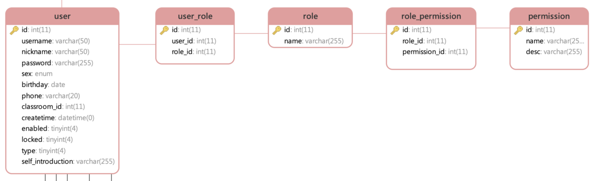

# 续MyBatis Plus 简化开发

## 环境配置

上次课我们已经添加了MyBatisPlus需要的依赖

但是只有依赖是不能运行的

需要配置application.properties文件中添加的内容

```properties
spring.datasource.driver-class-name=com.mysql.cj.jdbc.Driver
spring.datasource.url=jdbc:mysql://localhost:3306/knows?characterEncoding=utf8&useSSL=false&serverTimezone=Asia/Shanghai&rewriteBatchedStatements=true
spring.datasource.username=root
spring.datasource.password=root
```

SpringBoot启动类中还要添加一个配置

```java
@SpringBootApplication
//@MapperScan是MyBatis的注解
//功能是指定一个包中所有的接口是MyBatis框架的mapper接口
// 这样这个包中所有接口就不需要每个都使用@Mapper标记了
@MapperScan("cn.tedu.knows.portal.mapper")
public class KnowsPortalApplication {

    public static void main(String[] args) {
        SpringApplication.run(KnowsPortalApplication.class, args);
    }

}
```

## MyBatis Plus 的新功能(一)

每个实体类都会有最基本的连库操作需求

例如:新增一个对象到数据库,按id删除一个数据,按id查询一个数据,查询全部数据,修改数据....等

MyBatis Plus框架提供了一个功能,能够在接口中编写继承一个MyBatis Plus提供的父接口,这个父接口中已经编写好了对一个实体类基本的增删改查的操作,那么像上面的基本操作就不需要我们来编写了!

代码如下

```java
//BaseMapper就是MyBatisPlus提供的父接口,其中有对<>中指定的实体类
//的基本增删改查方法
public interface TagMapper extends BaseMapper<Tag> {

}
```

编写测试类来测试提供的方法

```java
@Autowired(required = false)
TagMapper tagMapper;

@Test
void testPlus(){
    /*Tag tag=new Tag();
    tag.setId(21);
    tag.setName("MybatisPlus");
    tag.setCreateby("admin");
    tag.setCreatetime("2021-6-25 10:00:00");
    int num=tagMapper.insert(tag);
    System.out.println("num:"+num);
    System.out.println("新增完毕");*/

    //Tag tag=tagMapper.selectById(21);
    //System.out.println(tag);

    /*List<Tag> tags=tagMapper.selectList(null);
    for(Tag t : tags){
        System.out.println(t);
    }*/

    int num=tagMapper.deleteById(21);
    System.out.println(num);
}

```

我们怎么知道上面的这些操作执行了什么样的sql语句呢

SpringBoot框架中,提供了日志的输出

MyBatis框架中实际上是将运行的sql语句输出到日志上的

只是输出的信息重要级别较低,被SpringBoot忽略了

我们需要调整SpringBoot框架显示日志的级别,来显示这些sql语句的运行信息

application.propertise文件添加内容

```properties
# 设置SpringBoot框架的日志输出门槛
logging.level.cn.tedu.knows.portal=debug
```

## MyBatis Plus 的新功能(二)

MyBatis Plus给我们提供的代码生成器的功能

我们需要生成什么代码呢?

项目中所有表对应的所有类和接口

如果一个一个去创建,太浪费时间,我们可以使用代码生成器生成

下面我们就开始着手生成这些代码

步骤1:

首先我们先创建一个新的子项目knows-generator

因为代码生成器只运行一次,放在portal项目中不合理

创建项目完毕之后父子相认

父项目pom.xml文件添加

```xml
<modules>
    <module>knows-portal</module>
    <!--  ↓↓↓↓↓↓↓↓↓↓↓↓↓↓↓↓↓    -->
    <module>knows-generator</module>
</modules>
```

子项目pom.xml

```xml
<?xml version="1.0" encoding="UTF-8"?>
<project xmlns="http://maven.apache.org/POM/4.0.0" xmlns:xsi="http://www.w3.org/2001/XMLSchema-instance"
         xsi:schemaLocation="http://maven.apache.org/POM/4.0.0 https://maven.apache.org/xsd/maven-4.0.0.xsd">
    <modelVersion>4.0.0</modelVersion>
    <parent>
        <groupId>cn.tedu</groupId>
        <artifactId>knows</artifactId>
        <version>0.0.1-SNAPSHOT</version>
        <relativePath/> <!-- lookup parent from repository -->
    </parent>
    <groupId>cn.tedu</groupId>
    <artifactId>knows-generator</artifactId>
    <version>0.0.1-SNAPSHOT</version>
    <name>knows-generator</name>
    <description>Demo project for Spring Boot</description>

    <dependencies>
        <dependency>
            <groupId>com.baomidou</groupId>
            <artifactId>mybatis-plus-boot-starter</artifactId>
        </dependency>
        <dependency>
            <groupId>org.springframework.boot</groupId>
            <artifactId>spring-boot-starter-freemarker</artifactId>
        </dependency>
        <dependency>
            <groupId>org.springframework.boot</groupId>
            <artifactId>spring-boot-starter</artifactId>
        </dependency>
        <dependency>
            <groupId>com.baomidou</groupId>
            <artifactId>mybatis-plus-generator</artifactId>
        </dependency>
        <dependency>
            <groupId>com.baomidou</groupId>
            <artifactId>mybatis-plus-extension</artifactId>
        </dependency>
        <dependency>
            <groupId>mysql</groupId>
            <artifactId>mysql-connector-java</artifactId>
        </dependency>
        <dependency>
            <groupId>org.projectlombok</groupId>
            <artifactId>lombok</artifactId>
        </dependency>
    </dependencies>
</project>
```

在cn.tedu.knows.generator包下创建一个类

CodeGenerator,这个类中的代码从苍老师网站下载

由于代码较多具体代码见项目

**需要将项目中原名称为straw的文字修改为knows**

还要添加一个模板文件用于生成内容

按照苍老师网站上的内容

在resources文件夹中创建ftl文件夹

在ftl文件夹中创建mapper.java.ftl文件

并复制内容到文件中

删除当前项目的test测试文件夹

执行CodeGenerator类中的可以行方法(70行附近)

在控制台输入all

就能在项目中生成如下代码


将这四个包复制到portal项目中即可

复制之后可以删除generator项目中的它们

测试Mapper

```java
@Autowired(required = false)
TagMapper tagMapper;
@Test
void getTag(){
    List<Tag> tags=tagMapper.selectList(null);
    for(Tag t:tags){
        System.out.println(t);
    }
}
@Test
void add(){
    /*Tag tag=new Tag()
            .setName("杂项")
            .setCreateby("admin")
            .setCreatetime(LocalDateTime.now());
    int num=tagMapper.insert(tag);
    //num表示本次数据库操作影响数据库的行数
    System.out.println(num);*/

    tagMapper.deleteById(22);

}
```

测试controller

```java
@RestController
//@RequestMapping注解写在控制器类上
//效果是当前类所有请求都需要使用/v1/tags做前缀才能访问到
@RequestMapping("/v1/tags")
public class TagController {

    //下面的hello方法要想访问它的路径就是
    //localhost:8080/v1/tags/hello
    @GetMapping("/hello")
    public String welcome(){
        return "hello welcome!!!";
    }

}
```

# Spring 安全框架

## 概述

Spring安全框架英文:Spring-Security

Spring安全框架，也就是Spring-Security，是Spring提供的安全管理框架，是Spring生态系统提供的关于安全方面的框架，它能够为基于Spring的企业应用系统提供声明式的安全访问控制解决方案。

Spring-Security框架我们主要使用其两个重要功能

1.密码加密与安全登录

2.登录用户权限管理

Spring-Security能够让菜鸟程序员也能编写出可靠的登录代码和权限管理的实现

## 初次使用

添加pom.xml文件的依赖

```xml
<!-- Spring Security -->
<dependency>
    <groupId>org.springframework.boot</groupId>
    <artifactId>spring-boot-starter-security</artifactId>
</dependency>
```

重启服务之后再访问该网站,就需要登录才能访问了

默认情况下有用户名是user

密码是启动服务后在控制台上显示的一个随机字符串

如果想自己定义用户名和密码

有很多方式

application.properties文件中支持我们编写用户名和密码

```properties
# Spring-Security定义用户名密码登录
spring.security.user.name=tom
spring.security.user.password=123456
```

再次重启服务,就不会出现随机的密码字符串了

使用我们配置的用户信息登录即可

## 密码加密

程序中无论是数据库还是配置文件

密码都不应该明文保存,因为这样做安全性太低了

我们要学习密码加密和验证,来实现加密的密码验证过程


加密的概念其实就是根据一个计算公式,将明文密码转换为密文密码的过程

我们不可能自己去编写这样的加密规则,我们使用Bcrypt来直接实现


加密验证过程

1. 将用户输入的密码进行加密

2. 将加密后的密码和数据库或配置文件中的密码进行比对
   1. 比对成功登录通过
   2. 比对失败登录失败

java程序中使用BcryptPasswordEncoder类来实现密码的加密和验证过程

具体代码如下

```java
//加密测试
@Test
void encode(){
    //PasswordEncoder密码加密类型对象的接口
    //多数流行的加密规则都实现自这个接口
    PasswordEncoder encoder=new BCryptPasswordEncoder();
    //将密码123456加密后返回加密结果
    String pwd=encoder.encode("123456");
    System.out.println(pwd);
    //每次加密的得到的密码不同,是当前加密算法的"随机加盐"技术
    //是为了提高密码加密的安全性
    //$2a$10$f7b5X9txC178W6fDF7rPOeUWHGdwI9uqmmL9/3DD7xt4GJnT0bQxS
}
//密码验证
    @Test
    void match(){
        PasswordEncoder encoder=new BCryptPasswordEncoder();
        //调用matches方法验证一个字符串是否匹配一个加密结果
        //matches方法两个参数,1是明文字符串,2是加密字符串
        //返回这个明文字符串是否匹配加密字符串
        boolean b=encoder.matches("123456",
                "$2a$10$f7b5X9txC178W6fDF7rPOeUWHGdwI9uqmmL9/3DD7xt4GJnT0bQxS");
        System.out.println("验证结果:"+b);
    }
```

我们将上面测试得到的密码粘贴到配置文件中

```properties
# Spring-Security定义用户名密码登录
spring.security.user.name=tom
spring.security.user.password={bcrypt}$2a$10$f7b5X9txC178W6fDF7rPOeUWHGdwI9uqmmL9/3DD7xt4GJnT0bQxS
```

再次重启服务,就可以使用123456匹配配置文件中的密文密码来登录了

## 设置权限访问资源

如果不使用配置文件,怎么通过java代码来进行用户名密码的设置

Spring-Security还提供了权限访问限制的功能,怎么去使用

下面我们就通过一个类了解上面两个问题

```java
//@Configuration这个注解表示当前类是Spring的配置类
@Configuration
//启动Spring-Security的框架的权限管理功能
@EnableGlobalMethodSecurity(prePostEnabled = true)
public class SecurityConfig extends WebSecurityConfigurerAdapter {

    @Override
    protected void configure(AuthenticationManagerBuilder auth) throws Exception {
        //参数auth就是管理Spring-Security进行登录和权限管理的核心对象
        //通过代码设置一个可以登录到Spring-Security的用户
        //注意一旦设置了代码,配置文件中的用户就失效了
        auth.inMemoryAuthentication()
                .withUser("jerry")
                .password("{bcrypt}$2a$10$f7b5X9txC178W6fDF7rPOeUWHGdwI9uqmmL9/3DD7xt4GJnT0bQxS")
                .authorities("add");

    }
}
```

上面配置的jerry用户拥有add权限

这个权限指访问特殊方法的凭证

我们在TagController控制器类中添加两个方法

这两个方法分别需要不同的特殊权限

```java
@GetMapping("/get")
//下面的注解表示当前方法需要用户拥有特殊权限才能访问
@PreAuthorize("hasAuthority('add')")
public Tag getTag(){
    Tag t=new Tag();
    t.setName("乾坤大挪移");
    return t;
}
@GetMapping("/list")
@PreAuthorize("hasAuthority('delete')")
public Tag getList(){
    Tag t=new Tag();
    t.setName("九阴白骨爪");
    return t;
}
```

重启服务,登录jerry

他能够访问需要add资格的get方法

但是不能访问需要delete资格的list方法

这就是权限的限制效果!

## 项目中用户和权限的关系




用户user

角色role

权限permission

用户                                  角色(身份)                        权限

张三丰								学生								签到

乔峰									授课老师						查看成绩

欧阳锋								班主任							学生管理

杨过									年级组长						课程管理

郭靖									教导主任						课表管理

​											校长								教师管理

​																					学校倒闭


https://gitee.com/jtzhanghl/knows2103.git

# 随笔

日志级别

常见的日志级别

重要级别从低到高

trace

debug

info          SpringBoot框架默认显示Info以上级别的日志输出

warn

error


MD5和Bcrypt是当今流行的加密算法


数据库中表和表的关系有3种

1.一对多(多对一)

2.一对一(少见)

3.多对多


